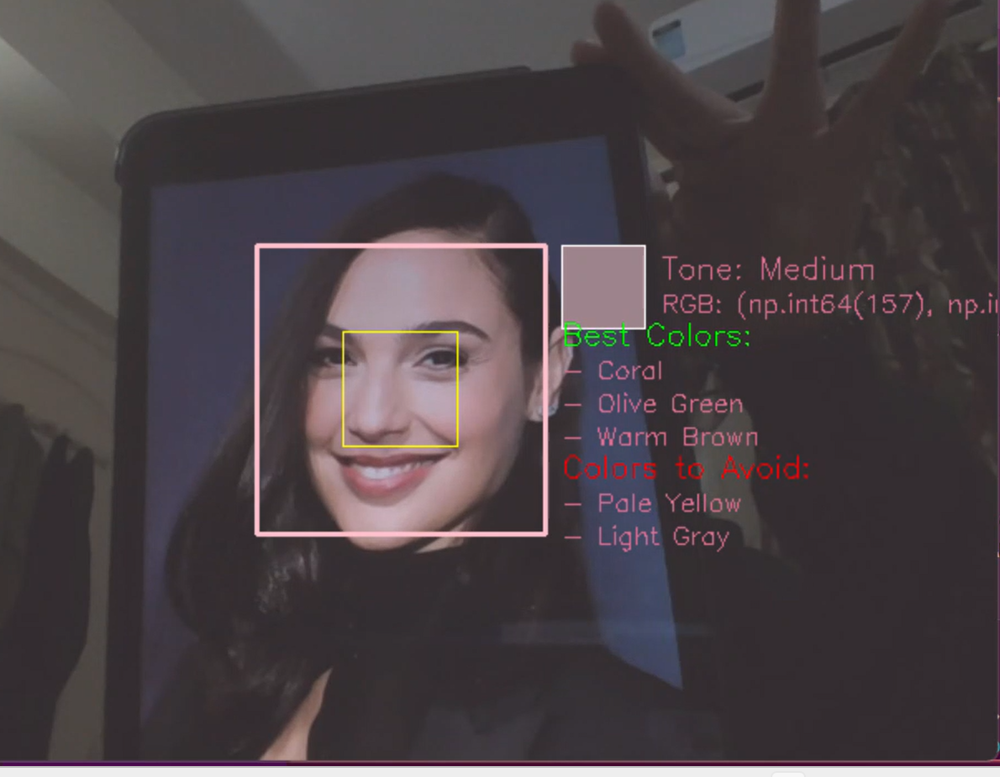

# Real-Time Skin Tone Analyser

<p>
  
  
  
</p>

A real-time computer vision tool that detects skin tone from a live webcam feed and generates personalised colour palette recommendations — built with Python and OpenCV.

---

## Demo



*Real-time detection — tone classified as Medium, RGB values displayed, complementary colours recommended instantly.*

---

## Inspiration

While exploring colour theory, I was fascinated by how certain colours enhance or clash with different skin tones. I built this to combine that idea with computer vision — taking colour theory from an Instagram reel to a working, real-time Python application.

---

## How It Works

```
Webcam Feed → Face Detection (Haar Cascade) → Skin Region Sampling
                                                      ↓
                                           RGB Analysis + Brightness Score
                                                      ↓
                                        Tone Classification + Colour Recommendations
```

1. **Face detection** — OpenCV Haar Cascade locates the face in each frame
2. **Region sampling** — central 30–70% of the face sampled to avoid hair and edges
3. **Colour analysis** — average RGB calculated; brightness score mapped to tone category
4. **Classification** — Fair / Light / Medium / Tan / Dark
5. **Recommendations** — 3 complementary colours + 2 colours to avoid, updated in real time

---

## Features

- Real-time face detection at 30 FPS
- Skin tone classification across 5 brightness categories
- Personalised colour palette (best matches + colours to avoid)
- Live RGB value display and colour patch visualisation
- Press `s` to save a snapshot with full analysis overlay
- Works across varied lighting conditions

---

## Setup

```bash
# Clone the repo
git clone https://github.com/akansha0724/Skintone-Analysis.git
cd Skintone-Analysis

# Install dependencies
pip install -r requirements.txt

# Run
python colouranalysis.py
```

**Controls:** `s` — save snapshot &nbsp;|&nbsp; `q` — quit

---

## Tech Stack

- **OpenCV** — face detection and video processing
- **Python** — colour space conversion, brightness analysis, recommendation logic
- **Haar Cascade Classifier** — pre-trained frontal face detector

---

## Project Structure

```
├── colouranalysis.py                    # Main application
├── undertonanalysis.py                  # Undertone analysis module
├── haarcascade_frontalface_default.xml  # Face detection model
├── assets/                              # Saved snapshots
└── requirements.txt
```
